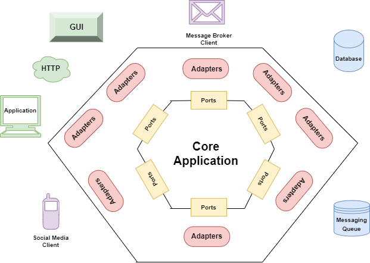

# Hexagonal Architecture / Ports and Adapters

> _Allow an application to equally be driven by users, programs, automated test or batch scripts, and to be developed and tested in isolation from its eventual run-time devices and databases._ - Cockburn

- Definição de limites e proteção nas regras da aplicação
- Componentização e desacoplamento
  - _Logs_
  - _Cache_
  - _Upload_
  - Banco de Dados
  - Comandos
  - Filas
  - HTTP, APIs, GraphQL
- Facilidade na quebra para microserviços

 

### Hexagono

- É um modelo visual adotado para separar as camadas do sistema. Sendo a camada interna o _Core_ onde se trabalha o domínio da aplicação. Separado da camada externa que trabalha com a complexidade técnica.

### _Ports_

- São as interfaces a serem implementadas pelos _adapters_. A forma como a aplicação irá assinar os metodos necessários para o funcionamento.

### _Adapters_

- São as as implementações das tecnologias baseado nos _ports_. Mantendo a consistência na utilização necessária pela aplicação.

### _Dependency Inversion Principle_

- Um princípio do SOLID utilizado pela arquitetura, pois permite que camadas internas (de domínio) não dependam de camadas externas. Trabalhando apenas com abstrações.

  

